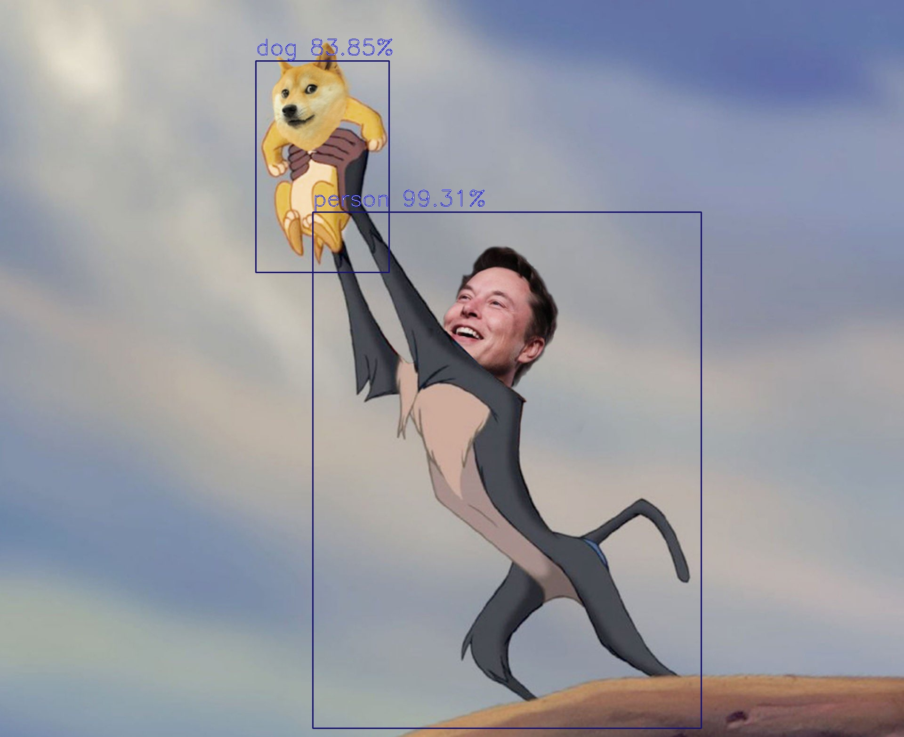
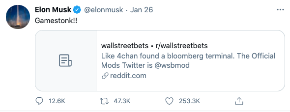
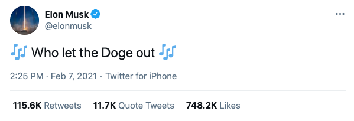
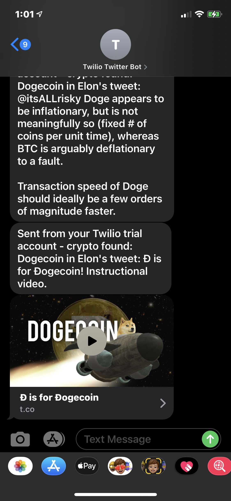

# Dogefather

## About
This program streams tweets from Elon Musk and checks if the tweets contain references to popular stocks or cryptocurrencies. If the tweet contains text, it will scan the text for potential names or tickers of commonly traded stocks and popular cryptocurrencies. If the tweet contains images, the program will use Google VisionAI to annotate the images to determine if images contain references to stocks or cryptos. It can detect objects in images, logos, and text in images. If the program finds images or text referencing stocks or cryptocurrencies, it will send an SMS to the configured phone number using the Twilio API. 

## Installation

### Requiremmts
1. Python 3.8
2. Twitter developer account
3. Twilio account (trial account is fine)
4. Google Cloud Platform account (for image recognition)

### Instructions
1. Clone repository
2. <code>cd Dogefather</code>
3. <code>pip3 install -r requirements.txt</code>
4. Create a .env file and add Twitter API consumer key, consumer secret key, and bearer token as shown in .env.example
5. Add the Twilio account sid and Twilio auth token to the .env file as shown in the .env.example file
6. Add Google Vision API key to the .env file as shown in the .env.example file
7. Add your phone number with +1 (ex: '+1800XXXXXXX') and your Twilio phone number in the same format as shown in .env.example
8. <code>python3 TweetBot.py</code>

## Examples
### Image Recognition

### Find stock in tweet

### Find crypto in tweet

### Send alerts 

## Notes
stocks.json contains 100 most popular stocks and cryptos.json contains 5 popular cryptos. moreStocks.json contains all stocks and moreCryptos.json contains all cryptos. See https://cloud.google.com/vision/docs/setup for a quickstart of the Vision API.

## What's Next
1. Streaming tweets from more accounts rather than just Elon Musk.